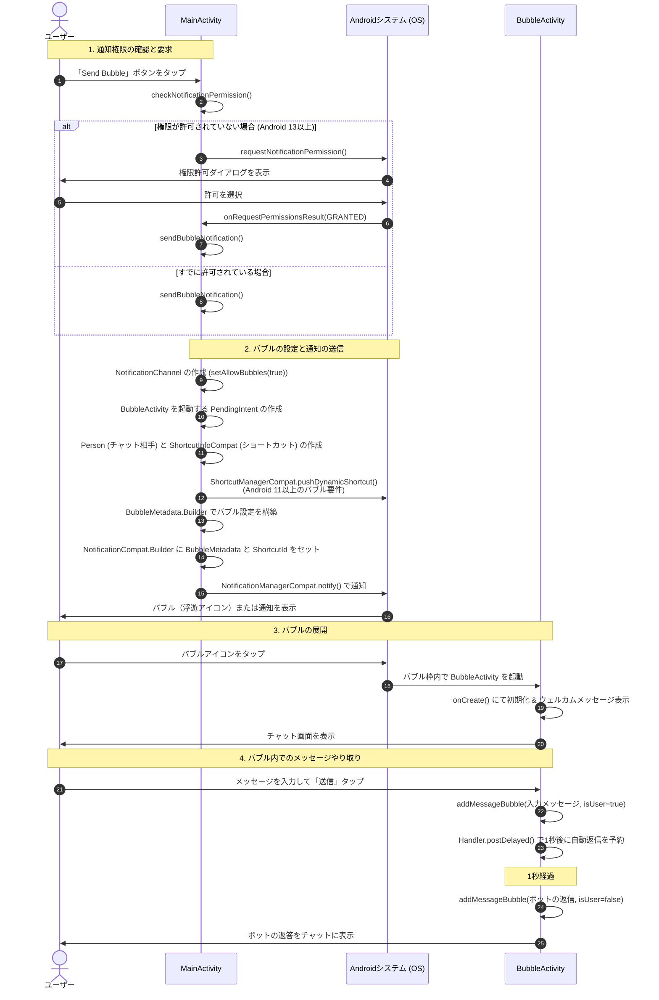

# AndKot-BubbleNotificationSample
Androidの通知Bubbleのサンプル

```mermaid
sequenceDiagram
    autonumber
    actor User as ユーザー
    participant MA as MainActivity
    participant OS as Androidシステム (OS)
    participant BA as BubbleActivity

    Note over User, MA: 1. 通知権限の確認と要求
    User->>MA: 「Send Bubble」ボタンをタップ
    MA->>MA: checkNotificationPermission()
    alt 権限が許可されていない場合 (Android 13以上)
        MA->>OS: requestNotificationPermission()
        OS->>User: 権限許可ダイアログを表示
        User->>OS: 許可を選択
        OS->>MA: onRequestPermissionsResult(GRANTED)
        MA->>MA: sendBubbleNotification()
    else すでに許可されている場合
        MA->>MA: sendBubbleNotification()
    end

    Note over MA, OS: 2. バブルの設定と通知の送信
    MA->>MA: NotificationChannel の作成 (setAllowBubbles(true))
    MA->>MA: BubbleActivity を起動する PendingIntent の作成
    MA->>MA: Person (チャット相手) と ShortcutInfoCompat (ショートカット) の作成
    MA->>OS: ShortcutManagerCompat.pushDynamicShortcut() <br/> (Android 11以上のバブル要件)
    MA->>MA: BubbleMetadata.Builder でバブル設定を構築
    MA->>MA: NotificationCompat.Builder に BubbleMetadata と ShortcutId をセット
    MA->>OS: NotificationManagerCompat.notify() で通知
    OS->>User: バブル（浮遊アイコン）または通知を表示

    Note over User, BA: 3. バブルの展開
    User->>OS: バブルアイコンをタップ
    OS->>BA: バブル枠内で BubbleActivity を起動
    BA->>BA: onCreate() にて初期化 & ウェルカムメッセージ表示
    BA->>User: チャット画面を表示

    Note over User, BA: 4. バブル内でのメッセージやり取り
    User->>BA: メッセージを入力して「送信」タップ
    BA->>BA: addMessageBubble(入力メッセージ, isUser=true)
    BA->>BA: Handler.postDelayed() で1秒後に自動返信を予約
    Note over BA: 1秒経過
    BA->>BA: addMessageBubble(ボットの返信, isUser=false)
    BA->>User: ボットの返答をチャットに表示
```
